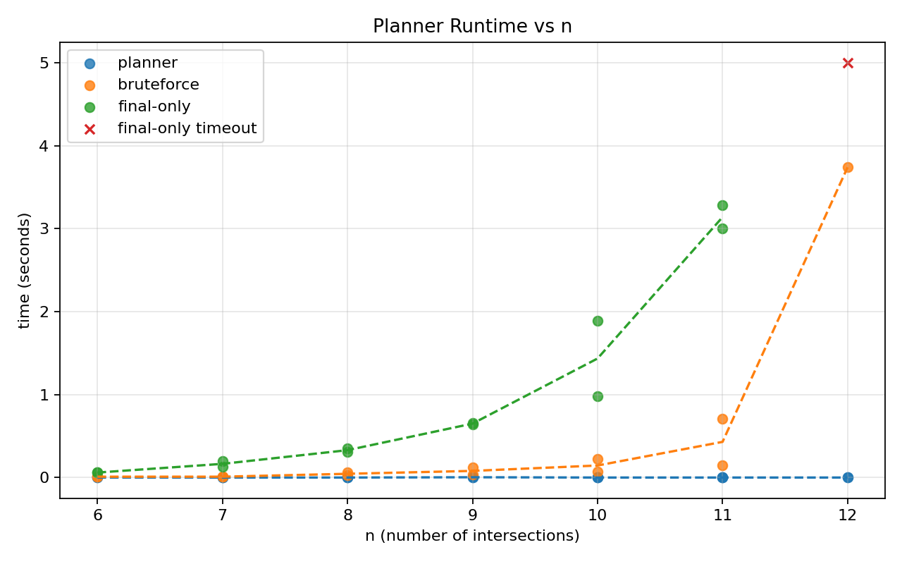
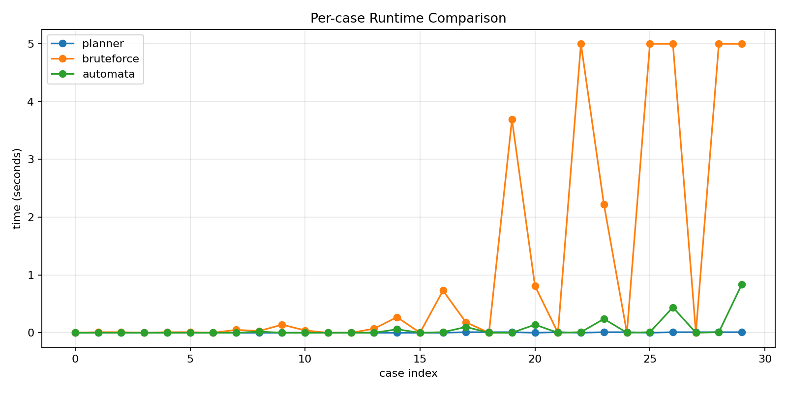

# LTL Planner + Validator

This repo contains three separate programs:
- `planner.cpp`: the locality-based planner (fast, intended algorithm).
- `bruteforce-planner.cpp`: a brute-force baseline (slow, with a timeout).
- `ltlf-progress-planner.cpp`: an automata/progression LTLf baseline.
- `validate.cpp`: the independent validator (checks correctness only).

There are also scripts for systematic test generation, benchmarking, and plotting.

## 0) Approaches and Comparisons

This repo now supports three clearly distinct planning approaches for comparison:

- Planner (`planner.cpp`): Implements the locality-based “graph of substates” algorithm with locality parameter `L`. It restricts what can still change and prunes using validity checks over a moving window.
- Brute-force with step pruning (`bruteforce-planner.cpp`): Explores full valuations plus temporal memory and prunes immediately if any value is violated at an intermediate step. This is a strong but still-local baseline that enforces values “online.”
- Automata / progression baseline (`ltlf-progress-planner.cpp`): Uses a standard LTLf idea from the literature: translate the temporal goals into an automaton (or build it on the fly) and search in the product of planning states and automaton states. Here we build the automaton state on the fly using syntactic progression of the formulas. citeturn0search3turn0search5

### Automata / Progression Baseline Details

This baseline is meant to be readable without automata background. The core
idea is:

1. Keep track of “what remains to be satisfied” for each temporal goal.
2. Update that remainder after each action.
3. Search over both the planning state and those remainders together.

This is exactly the automata/product-state approach used in LTLf synthesis and
planning, but done on the fly via progression rather than pre-building a full
automaton. citeturn0search3turn0search5

Concretely, `ltlf-progress-planner.cpp` does the following:

- Parse each value formula into a small syntax tree with operators `NOT`, `AND`,
  `OR`, `X`, `F`, `G`, `U`, and `FG`.
- Represent the temporal “remainder” of each formula as a residual formula.
- After each state update, progress every residual formula through the current
  valuation. If any residual becomes `FALSE`, that branch is impossible and is
  pruned immediately.
- Check acceptance by asking: “could I stop here and still satisfy all values?”
  This is implemented as empty-trace acceptance of each residual, plus explicit
  final-state checks for `FG`.
- Run a breadth-first search over the product state:
  `(planning valuation, residual formulas)`, with a visited table keyed by both
  parts together.

Two modeling notes that match the current validator:

- The validator treats `FG` as a final-state condition. The automata baseline
  mirrors this for root-level `FG` values.
- Nested `FG` occurrences are handled conservatively by removing them from the
  progression state and checking only root-level `FG` at the end.

## 1) Basic Setup: Build, Run, Validate

Build all programs:

```bash
g++ -std=c++17 -O2 -Wall -Wextra -pedantic planner.cpp -o planner
g++ -std=c++17 -O2 -Wall -Wextra -pedantic bruteforce-planner.cpp -o bruteforce-planner
g++ -std=c++17 -O2 -Wall -Wextra -pedantic ltlf-progress-planner.cpp -o ltlf-progress-planner
g++ -std=c++17 -O2 -Wall -Wextra -pedantic validate.cpp -o validate
```

Use the input-only format as planner input, and the full format as validator input.

Single-case workflow:

```bash
./planner --L 3 < input-only.txt > planned.full.txt
./validate < planned.full.txt
```

With systematic tests:

```bash
./planner --L 3 < tests_systematic/case-0.input-only.txt > tests_systematic/case-0.full.txt
./validate < tests_systematic/case-0.full.txt
```

Notes:
- The planners do not perform validation. Only `validate` checks correctness.
- The planner output is intentionally in the validator’s full input format.

## 2) Test Generation: Systematic, Parameterized

The generator `gen-systematic-tests.cpp` creates deterministic, size-ordered
families of traffic-light-like instances with locality structure.

Build the generator:

```bash
g++ -std=c++17 -O2 -Wall -Wextra -pedantic gen-systematic-tests.cpp -o gen-systematic-tests
```

Generate a systematic suite:

```bash
./gen-systematic-tests --dir tests_systematic --n-min 6 --n-max 24 --per-n 3 --seed 2026
```

What it generates:
- A family of ring-structured instances indexed by `n`.
- Local atoms per light: `on_i`, `broken_i`.
- A global atom: `congestion`.
- Transition rules (`gamma`) aligned with the planner/validator format.
- Values typically include `F G on_i` (for each light) and `G !congestion`.
- Broken-light patterns are chosen systematically (non-adjacent where possible).

Files produced (per case):
- `*.input-only.txt`: planner input.
- `manifest.txt`: metadata with `n` and broken pattern per case.

Flag details for the generator live in `gen-systematic-tests.cpp`.

Deprecated random tests and the old generator live under `deprecated/`.

## 3) Running Benchmarks and Generating Charts

### Benchmarking

Use `benchmark.sh` to run the planner and two baselines with timeouts and produce a CSV.

Example (planner under 10s, baselines under 30s):

```bash
./benchmark.sh \
  --dir tests_systematic \
  --L 3 \
  --max-depth 160 \
  --planner-timeout 10 \
  --bf-timeout 30 \
  --auto-timeout 30 \
  --out tests_systematic/benchmark.csv
```

Flag details for benchmarking live in `benchmark.sh`, `planner.cpp`, `bruteforce-planner.cpp`, and `ltlf-progress-planner.cpp`.

Behavior:
- Cases are sorted by size `n` when `manifest.txt` is present.
- If `--dir .` is used, `deprecated/` is excluded automatically.
- The CSV includes both baselines: `bruteforce_*` and `automata_*`.
- Timeout statuses are typically `124` or `137` (normalized to the timeout value for clearer plots).

### Current Benchmark Snapshot (January 27, 2026)

The checked-in benchmark and plots were generated with:

```bash
./benchmark.sh \
  --dir tests_systematic \
  --L 3 \
  --max-depth 80 \
  --planner-timeout 10 \
  --bf-timeout 5 \
  --auto-timeout 5 \
  --limit 30 \
  --out tests_systematic/benchmark.csv
python3 plot-benchmarks.py --csv tests_systematic/benchmark.csv
```

On these 30 cases:

- Locality planner successes: 29 / 30.
- Brute-force successes: 15 / 30.
- Automata baseline successes: 20 / 30.

These counts come directly from `tests_systematic/benchmark.csv`.




### Results Discussion

Across both the benchmark snapshot (30 cases) and the full batch run (57 cases
on January 27, 2026), the locality-based planner is the most reliable within
the same depth and timeout budgets. The automata/progression baseline is a
meaningful improvement over the brute-force baseline under tight timeouts, but
it still trails the locality planner on larger instances.

A practical reading of the comparison is:

- Locality pruning dominates in this structured domain.
- Automata/progression pruning is helpful and “literature-standard,” but it does
  not exploit the interval/locality structure.
- Brute-force step pruning is the weakest of the three under the current bounds.

The persistent `case-0` failure is consistent across approaches and appears to
be an unsatisfiable instance under the given depth bounds.

### Plotting

Use `plot-benchmarks.py` to generate plots from the CSV:

```bash
python3 plot-benchmarks.py --csv tests_systematic/benchmark.csv
```

This writes plots next to the CSV (by default):
- `tests_systematic/benchmark-time-vs-n.png`
- `tests_systematic/benchmark-time-vs-case.png`

If needed, you can choose a different output folder:

```bash
python3 plot-benchmarks.py --csv tests_systematic/benchmark.csv --out-dir tests_systematic
```

Flag details for plotting live in `plot-benchmarks.py`.

## Other Helpful Commands

Batch validation with the run script:

```bash
./run-tests.sh automata --dir tests_systematic
./run-tests.sh both --dir tests_systematic
./run-tests.sh all --dir tests_systematic
```

If you point it at `--dir .`, it will skip `deprecated/`.

Flag details for the test runner live in `run-tests.sh`.

### Current Test Snapshot (January 27, 2026)

A full batch run across `tests_systematic/` with bounded timeouts:

```bash
./run-tests.sh all \
  --dir tests_systematic \
  --planner-timeout 10 \
  --bf-timeout 5 \
  --auto-timeout 2
```

Results on 57 cases:

- Locality planner: 56 ok, 1 fail (`case-0`).
- Brute force: 16 ok, 41 fail.
- Automata baseline: 31 ok, 26 fail.
