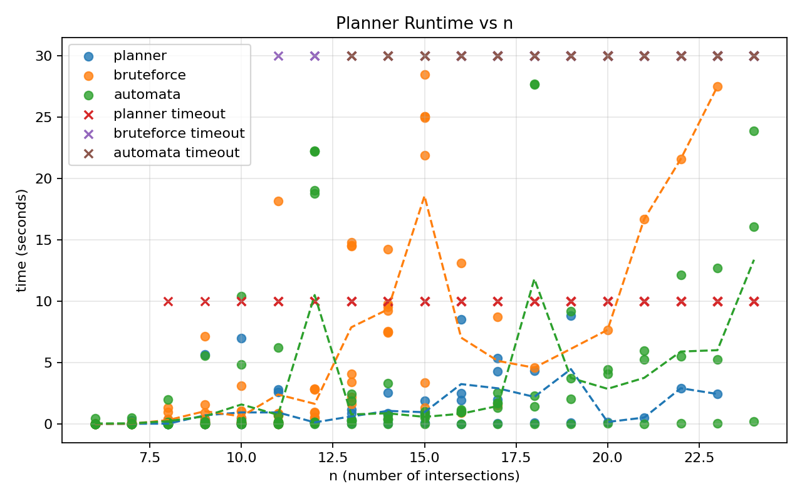
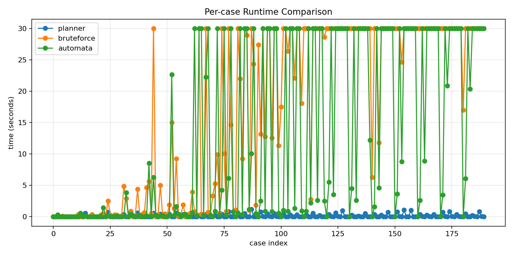

# Locality-based ethical planning

This repository contains the code and paper sources for locality-based ethical
planning with linear temporal logic values.

Main components:
- `planner.cpp`: the locality-based planner used in the paper.
- `bruteforce-planner.cpp`: a brute-force planning baseline.
- `ltlf-progress-planner.cpp`: an automata/progression `LTL_f` baseline.
- `validate.cpp`: the independent validator.
- `score-plan.cpp`: the scorer for weighted conflict-resolution outputs.

There are also scripts for systematic test generation, benchmarking, scoring,
and plotting.

License:
- This repository is released under the MIT License (see `LICENSE`).
- Generated benchmark artifacts in this repository are released under the same license.

## 0) Approaches and Comparisons

This repo now supports three clearly distinct planning approaches for comparison:

- Planner (`planner.cpp`): Implements the locality-based “graph of substates” algorithm with locality parameter `L`. It restricts what can still change and prunes using validity checks over a moving window.
- Brute-force with step pruning (`bruteforce-planner.cpp`): Explores full valuations plus temporal memory and prunes immediately if any value is violated at an intermediate step. This is a strong but still-local baseline that enforces values “online.”
- Automata / progression baseline (`ltlf-progress-planner.cpp`): Uses a standard LTLf idea from the literature: translate the temporal goals into an automaton (or build it on the fly) and search in the product of planning states and automaton states. Here we build the automaton state on the fly using syntactic progression of the formulas.

### Automata / Progression Baseline Details

This baseline is meant to be readable without automata background. The core
idea is:

1. Keep track of “what remains to be satisfied” for each temporal goal.
2. Update that remainder after each action.
3. Search over both the planning state and those remainders together.

This is exactly the automata/product-state approach used in LTLf synthesis and
planning, but done on the fly via progression rather than pre-building a full
automaton.

Concretely, `ltlf-progress-planner.cpp` does the following:

- Parse each value formula into a small syntax tree with operators `NOT`, `AND`,
  `OR`, `X`, `F`, `G`, `U`, and `FG`.
- Represent the temporal “remainder” of each formula as a residual formula.
- After each state update, progress every residual formula through the current
  valuation. If any residual becomes `FALSE`, that branch is impossible and is
  pruned immediately.
- Check acceptance by asking: “could I stop here and still satisfy all values?”
  This is implemented as empty-trace acceptance of each residual, plus explicit
  final-state checks for `FG`.
- Run a breadth-first search over the product state:
  `(planning valuation, residual formulas)`, with a visited table keyed by both
  parts together.

Two modeling notes that match the current validator:

- The validator treats `FG` as a final-state condition. The automata baseline
  mirrors this for root-level `FG` values.
- Nested `FG` occurrences are handled conservatively by removing them from the
  progression state and checking only root-level `FG` at the end.

References (automata / LTLf background):

- De Giacomo, G., & Vardi, M. Y. (2013). Linear Temporal Logic and Linear Dynamic Logic on Finite Traces.
- Camacho, A., Baier, J. A., Muise, C., & McIlraith, S. A. (2018). Finite LTL Synthesis as Planning.

## 1) Basic Setup: Build, Run, Validate

Build all programs:

```bash
g++ -std=c++17 -O2 -Wall -Wextra -pedantic planner.cpp -o planner
g++ -std=c++17 -O2 -Wall -Wextra -pedantic bruteforce-planner.cpp -o bruteforce-planner
g++ -std=c++17 -O2 -Wall -Wextra -pedantic ltlf-progress-planner.cpp -o ltlf-progress-planner
g++ -std=c++17 -O2 -Wall -Wextra -pedantic validate.cpp -o validate
g++ -std=c++17 -O2 -Wall -Wextra -pedantic score-plan.cpp -o score-plan
```

Single-line build:

```bash
g++ -std=c++17 -O2 -Wall -Wextra -pedantic planner.cpp -o planner && \
g++ -std=c++17 -O2 -Wall -Wextra -pedantic bruteforce-planner.cpp -o bruteforce-planner && \
g++ -std=c++17 -O2 -Wall -Wextra -pedantic ltlf-progress-planner.cpp -o ltlf-progress-planner && \
g++ -std=c++17 -O2 -Wall -Wextra -pedantic validate.cpp -o validate && \
g++ -std=c++17 -O2 -Wall -Wextra -pedantic score-plan.cpp -o score-plan
```

Use model-only inputs as planner input, and the full format as validator input.

Single-case workflow:

```bash
./planner --L 3 < example1-linear.txt > planned.full.txt
./validate < planned.full.txt
```

Main example inputs in the project root:
- `example1-linear.txt`
- `example2-chargers.txt`
- `example3-production-corridor.txt`

Planner flags:
- `--L L`: locality parameter (default 3).
- `--mode MODE`: one of `arbitrary`, `shortest`, or `conflict`.
- `--early-stop`: if there are no `F`/`U` values, stop as soon as all `FG`/`G`
  (and non-temporal) values hold in the full current state. This can shorten
  plans but does not change correctness.

Examples:

```bash
./planner --L 3 --mode shortest < example1-linear.txt > planned.shortest.full.txt
./validate < planned.shortest.full.txt

./planner --L 3 --mode conflict < example1-linear.txt > planned.conflict.full.txt
./score-plan < planned.conflict.full.txt
```

With systematic tests:

```bash
./planner --L 3 < tests_systematic/case-0-ex1.input-only.txt > tests_systematic/case-0-ex1.paper.full.txt
./validate < tests_systematic/case-0-ex1.paper.full.txt
```

Notes:
- The planners do not perform validation. Only `validate` checks correctness.
- The planner output is intentionally in the validator’s full input format.

## 2) Test Generation: Systematic, Parameterized

The generator `gen-systematic-tests.cpp` creates deterministic, size-ordered
benchmark instances across the three paper families.

Build the generator:

```bash
g++ -std=c++17 -O2 -Wall -Wextra -pedantic gen-systematic-tests.cpp -o gen-systematic-tests
```

Generate a systematic suite:

```bash
./gen-systematic-tests --dir tests_systematic --n-min 6 --n-max 24 --per-n 3 --seed 2026
```

What it generates:
- Example 1: linear traffic lights with break/fix actions and congestion safety.
- Example 2: chargers with `lowBattery` and `chargedOnce` policy constraints.
- Example 3: three-lane production corridor with lane switches, service cells,
  occupied crossings, and terminal target.
- Deterministic pattern variation per size `n` and fixed family cycling.

Files produced (per case):
- `*.input-only.txt`: planner input.
- `manifest.txt`: metadata with `n` and index pattern per case.

Flag details for the generator live in `gen-systematic-tests.cpp`.

Deprecated random tests and the old generator live under `deprecated/`.

Additional example input:

- `ProblemDescriptionC.txt`: charger-domain example with `lowBattery` and
  `chargedOnce`. It exercises `U` formulas such as
  `NOT(charged_i) U lowBattery`.

## 3) Running Benchmarks and Generating Charts

### Benchmarking

Use `benchmark.sh` to run the planner and two baselines with timeouts and produce a CSV.

Example (equal 15s timeout for all approaches):

```bash
./benchmark.sh \
  --dir tests_systematic \
  --L 3 \
  --max-depth 160 \
  --planner-timeout 15 \
  --bf-timeout 15 \
  --auto-timeout 15 \
  --out tests_systematic/benchmark.csv \
  --validate
```

Flag details for benchmarking live in `benchmark.sh`, `planner.cpp`, `bruteforce-planner.cpp`, and `ltlf-progress-planner.cpp`.

Behavior:
- Cases are sorted by size `n` when `manifest.txt` is present.
- If `--dir .` is used, `deprecated/` is excluded automatically.
- The CSV includes both baselines: `bruteforce_*` and `automata_*`.
- Timeout statuses are typically `124` or `137` (normalized to the timeout value for clearer plots).
- With `--validate`, the CSV adds `planner_valid`, `bf_valid`, and `auto_valid`:
  `0` means valid, `1` means invalid, `2` means skipped because the planner
  failed or timed out. Validation is not included in the timing.

### Locality Variants

Use `benchmark-locality-variants.sh` to benchmark the three locality-based modes:
default DFS (`arbitrary`), shortest satisfactory plans (`shortest`), and
minimum-violation planning (`conflict`).

Original strict suite:

```bash
./benchmark-locality-variants.sh \
  --dir tests_systematic \
  --L 3 \
  --max-depth 160 \
  --timeout 15 \
  --out tests_systematic/locality-variants.csv \
  --validate \
  --score-conflict
```

Derived conflicting suite:

```bash
./make-conflict-suite.py --in-dir tests_systematic --out-dir tests_systematic_conflict
./benchmark-locality-variants.sh \
  --dir tests_systematic_conflict \
  --L 3 \
  --max-depth 160 \
  --timeout 15 \
  --out tests_systematic_conflict/locality-variants.csv \
  --score-conflict
```

Summaries:

```bash
python3 summarize-locality-variants.py --csv tests_systematic/locality-variants.csv
python3 summarize-locality-variants.py --csv tests_systematic_conflict/locality-variants.csv
```

### Current Benchmark Snapshot (February 26, 2026)

The checked-in benchmark and plots were generated with:

```bash
./gen-systematic-tests --dir tests_systematic --n-min 6 --n-max 16 --per-n 10 --seed 20260127
./benchmark.sh \
  --dir tests_systematic \
  --L 3 \
  --max-depth 160 \
  --planner-timeout 15 \
  --bf-timeout 15 \
  --auto-timeout 15 \
  --out tests_systematic/benchmark.csv \
  --validate
python3 plot-benchmarks.py --csv tests_systematic/benchmark.csv
```

To keep plots in the paper figure directory:

```bash
python3 plot-benchmarks.py --csv tests_systematic/benchmark.csv --out-dir figures
```

On the full 110-case suite (validation enabled):

- Locality planner successes: 110 / 110 (all 110 validated).
- Automata baseline successes: 105 / 110 (105 validated, 5 timeouts).
- Brute-force successes: 90 / 110 (90 validated, 20 timeouts).

These counts come directly from `tests_systematic/benchmark.csv`.
Here, “success” means the planner exited with status `0` within the configured
timeout. With `--validate`, all successful outputs are also checked by
`./validate`.

Runtime summary (successful runs only):
- Locality planner: mean 0.018s, median 0.00s, max 0.12s.
- Automata baseline: mean 0.572s, median 0.03s, max 12.05s.
- Brute force: mean 1.576s, median 0.25s, max 13.81s.

Mann-Whitney U tests using timeout-capped per-instance runtimes:
- locality vs brute-force: `p = 1.86e-31`
- locality vs automata/progression: `p = 3.90e-14`




### Results Discussion

The updated run shows that the optimized locality planner is both fast and
robust on this systematic suite: it solved all instances within the same 15s
timeout budget used for the baselines, with the lowest successful-run runtime
profile.

### Locality-Variant Snapshot (March 16, 2026)

On the original 110-instance suite:

- Default locality planner: `110/110`, mean time `0.019s`, median `0.00s`, max `0.13s`, mean plan length `47.44`.
- Shortest-plan locality: `110/110`, mean time `0.056s`, median `0.01s`, max `0.55s`, mean plan length `7.80`.
- Conflict-resolution locality: `110/110`, mean time `0.042s`, median `0.01s`, max `0.39s`, mean plan length `7.80`, penalty `0` on all cases.

The shortest-plan variant is strictly shorter on `62/110` cases and never longer.
Its largest effect is on the charger family, where mean plan length drops from
`133.27` to `5.88`.

On the derived contradictory 110-instance suite:

- Default locality planner: `0/110`.
- Shortest-plan locality: `0/110`.
- Conflict-resolution locality: `110/110`, mean time `0.268s`, median `0.03s`, max `3.25s`, mean plan length `7.76`.

For the conflicting suite, the external scorer agrees with the planner on all
cases and reports penalty `1` throughout.

A practical reading of the comparison is:

- Locality compression dominates in runtime and remains complete on the full
  suite.
- Automata/progression is robust overall, with remaining failures concentrated
  in the charging family.
- Brute-force still has the highest timeout count among the three methods.

### Plotting

Use `plot-benchmarks.py` to generate plots from the CSV:

```bash
python3 plot-benchmarks.py --csv tests_systematic/benchmark.csv
```

This writes plots next to the CSV (by default):
- `tests_systematic/benchmark-time-vs-n.png`
- `tests_systematic/benchmark-time-vs-case.png`
- `tests_systematic/benchmark-time-locality.png`
- `tests_systematic/benchmark-time-median-iqr-vs-n.png`
- `tests_systematic/benchmark-stats.txt`

If needed, you can choose a different output folder:

```bash
python3 plot-benchmarks.py --csv tests_systematic/benchmark.csv --out-dir figures
```

Flag details for plotting live in `plot-benchmarks.py`.

## Other Helpful Commands

Batch validation with the run script:

```bash
./run-tests.sh automata --dir tests_systematic
./run-tests.sh both --dir tests_systematic
./run-tests.sh all --dir tests_systematic
```

If you point it at `--dir .`, it will skip `deprecated/`.

Flag details for the test runner live in `run-tests.sh`.

For reproducible quantitative comparisons, prefer `benchmark.sh` over
`run-tests.sh`, because it stores per-case runtimes and statuses in a CSV and
drives the plotting/statistics workflow used in the paper.
